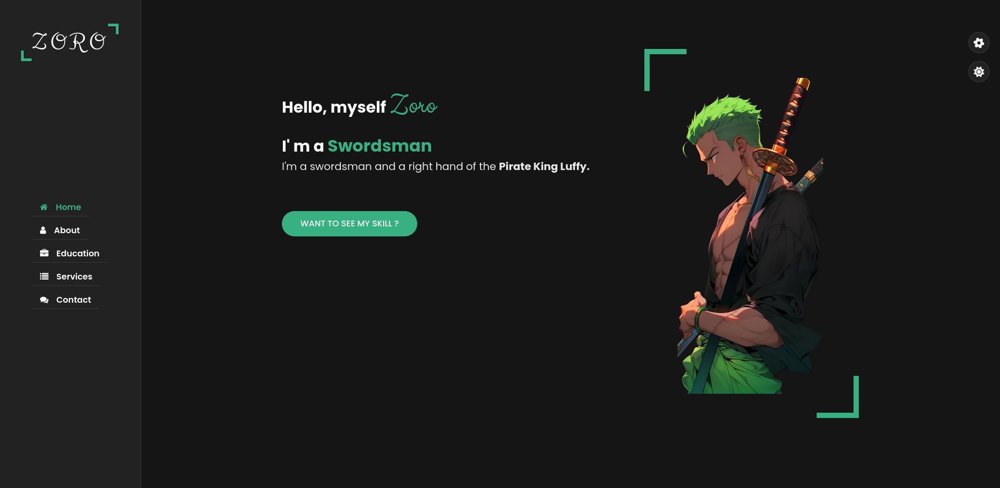

# Zoro

## Description

This website is tribute to my favorite anime character, Zoro, from the anime series called One Piece. This website showcases Zoro's journey as a skilled swordsman and his growth as a character.It allows users to explore Zoro's experiences, skills, and achievements in an engaging and immersive manner.

## Features of this portfolio

- **Dark/Light Mode**: The website offers a user-friendly interface with a toggle button that allows users to switch between dark and light modes, providing a personalized viewing experience.

- **Colorful Text**: The website lets you customize the color of the text with a simple click. You can choose from a variety of colors including green, yellow, pink, red, and violet to add a vibrant touch to your content.

## Installation

Follow these steps to install and run the project:

- Clone the repository:
        -- https://github.com/dhunganaPradeep/Zoro.git

- Open the project folder in your preferred code editor.

- Launch the website by opening the `index.html` file in your web browser.

## Contributing 

Contributions are welcome! If you have suggestions for additional features, please submit an issue or a pull request.

*Feel free to use this website template for your own personal or professional projects.*

### Created By 

[*Pradip Dhungana*](dhunganapradip.com.np)
